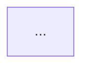
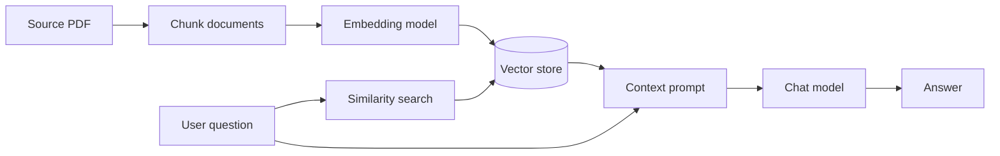

# Generative AI README

Create practical revision documentation from the code that is actually present in a Generative AI learning folder. The output should help the author understand the architecture, runtime flow, setup, limitations, and future improvements when revisiting the project later.

## When to Use

Use this skill when the user asks to:

- Generate README files for `Generative_AI` examples.
- Document architecture or an AI/RAG pipeline for future revision.
- Add diagrams to a model, prompting, agent, API, tokenization, or vector-search example.
- Create README files across every immediate subfolder, including relevant nested implementation folders.
- Refresh an existing README after the implementation changes.

## Scope and Safety

- Default target: the repository's `Generative_AI` folder.
- If the user names a target folder, document only that folder unless they explicitly request a broader scope.
- Interpret "every subfolder" as each immediate example folder plus nested folders that contain an independent entry point or subsystem.
- Create `README.md` inside the same folder as the code it documents.
- Preserve existing README files unless the user explicitly asks to update or replace them.
- Never invent endpoints, services, model names, configuration variables, or runtime behavior. Verify them from source files.
- Clearly label intended behavior when the source currently contains a syntax error, incomplete implementation, or known limitation.
- Do not fix unrelated source-code problems while creating documentation.
- Use ASCII by default. Use Mermaid syntax for diagrams so the guides remain editable and renderable in Markdown viewers.
- Do not document generated caches, secrets, virtual environments, or large data files as source components.

## Procedure

### 1. Discover the target folders

1. List the target directory recursively and group files by folder.
2. Identify source files, data files, service definitions, configuration files, generated artifacts, and existing README files.
3. Include nested folders when they contain an independently runnable or architecturally meaningful example.
4. Exclude generated caches such as `__pycache__` from documentation scope.
5. Check repository instructions that apply to README or customization files before editing.

For a batch request, make a short inventory first and then process one folder at a time. Do not create a generic README copied across unrelated examples.

### 2. Read the implementation locally

Read the smallest useful set of entry points and neighboring files before writing. For each target folder, determine:

- Purpose and learning objective.
- Main entry points and how they are run.
- Inputs, outputs, and data flow.
- Models, SDKs, databases, queues, APIs, and local services.
- Environment variables, hard-coded URLs, ports, collection names, and model names.
- Dependencies on sibling folders or previously generated data.
- Current limitations, incomplete behavior, and source-level errors.
- A nearby command that can validate the README or, when relevant, the documented run path.

Prefer exact evidence from source over assumptions. If an existing README is already accurate and detailed, leave it unchanged and mention that it was preserved.

Before writing each README, build this small evidence record:

```text
Purpose:         What does this folder demonstrate?
Entry point:     Which file or command starts it?
Inputs/outputs:  What crosses the boundary?
Dependencies:    Which services, models, APIs, or sibling folders are required?
Configuration:   Which values are environment variables versus hard-coded?
Validation:      What cheap check can verify the documentation?
Known blockers:  What prevents the documented run from working today?
```

If a value cannot be found in the source or project configuration, omit it or mark it as unknown instead of guessing.

### 3. Choose documentation depth

For a single small script, use a compact guide with:

- Purpose.
- One architecture or runtime-flow diagram.
- How to run it.
- Key revision notes.

For a multi-file application or pipeline, include:

- Architecture and component responsibilities.
- End-to-end runtime flow.
- Separate ingestion/indexing and query/generation diagrams for RAG.
- Sequence or state diagrams for queues, agents, or iterative loops.
- Configuration and prerequisites.
- Run commands and representative input/output shapes.
- Troubleshooting and future improvements.

### 4. Write the README

Use this structure when it fits the project:

```markdown
# Project title

Short description of what the example teaches.

## Architecture



## Runtime Flow

```mermaid
sequenceDiagram
    ...
```

## Components / Files

Table of source files and responsibilities.

## How It Works

Numbered steps grounded in the implementation.

## Prerequisites and Configuration

Only include dependencies and variables confirmed in the code or project configuration.

## Run

Commands from the correct working directory.

## Revision Notes

Important design decisions, hard-coded values, limitations, and known issues.

## Troubleshooting / Possible Improvements

Concrete, source-relevant follow-up ideas.
```

For RAG examples, explicitly document:

```text
source document -> loader -> chunks -> embeddings -> vector store
user query -> query embedding -> similarity search -> context prompt -> LLM answer
```

For agent examples, explicitly document:

```text
user input -> model step -> plan or tool call -> tool result -> model continuation -> output
```

For API examples, document the actual endpoint method, path, request shape, response shape, service URL, and whether the call is synchronous or asynchronous.

For prompting examples, compare the patterns demonstrated, such as zero-shot, few-shot, structured output, iterative planning, or persona-based prompting.

### Sample: compact RAG README section

Use this as a concrete quality target. Replace every placeholder with facts from the target folder:

```markdown
# Local PDF RAG

This example indexes a PDF into a vector store and uses similarity search to provide context to a chat model.

## Architecture



## Run

```powershell
docker compose up -d vector-db
python index.py
python chat.py
```

## Revision Notes

- Indexing must run before querying.
- The same embedding model must be used in both stages.
- The current implementation uses the default retrieval settings.
- The answer is prompt-grounded but not independently citation-verified.
```

The sample is a shape and clarity guide, not a reason to claim that a folder uses Qdrant, Docker, or Ollama unless its source confirms those components.

### 5. Add accurate diagrams

Use one or more diagrams that explain the actual implementation:

- `flowchart LR` or `flowchart TD` for architecture and data flow.
- `sequenceDiagram` for request and service interactions.
- `stateDiagram-v2` for agent states or job lifecycles.

Keep diagrams readable and avoid adding components that do not exist. Prefer separate diagrams for complex offline/online flows rather than one crowded diagram.

Diagram selection guide:

| Implementation shape | Preferred diagram |
| --- | --- |
| One script or data transformation | `flowchart LR` |
| HTTP or provider interaction | `sequenceDiagram` |
| Agent, queue, or retry lifecycle | `stateDiagram-v2` plus a sequence diagram if needed |
| RAG or ETL pipeline | Separate indexing and query flowcharts |

### 6. Validate

After writing:

1. Confirm every requested folder contains `README.md`.
2. Run the Markdown/file error checker when available.
3. Run `git diff --check` for the changed README files.
4. Verify that commands, paths, ports, model names, and environment variables match the source.
5. Do not run external-model or network-dependent examples merely to validate documentation unless the user explicitly requests it and prerequisites are available.
6. Report existing source blockers separately from documentation validation results.
7. For a batch request, validate the complete README inventory once after all folder edits and run focused checks for any README that reports a source blocker.

Prefer cheap validation in this order: file existence, Markdown diagnostics, `git diff --check`, then a source-specific command only when it is local, deterministic, and does not require credentials or external services.

## Quality Checklist

```text
[ ] README is inside the same folder as its implementation
[ ] Existing accurate README files were preserved
[ ] Architecture matches the actual source
[ ] At least one Mermaid diagram is included
[ ] RAG indexing and query flows are separated when applicable
[ ] Agent tool loops show tool-result continuation when applicable
[ ] API request and response shapes are documented accurately
[ ] Setup commands use the correct working directory
[ ] Hard-coded values and environment variables are distinguished
[ ] Known source bugs are disclosed without silently fixing them
[ ] No generated cache files are documented as source
[ ] Markdown and whitespace validation passed
[ ] A concrete sample or representative input/output is included when useful
[ ] Unknown values are omitted or explicitly marked, never guessed
```

## Completion Report

Keep the final report concise. State:

- Which README files were created or preserved.
- The kinds of diagrams and flows documented.
- Validation performed.
- Any source-code blockers that affect the documented run instructions.
