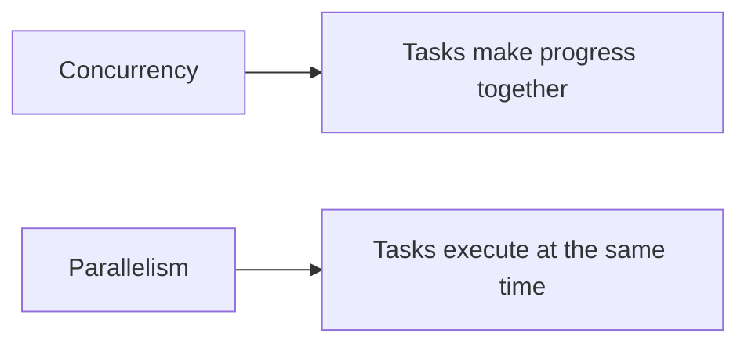
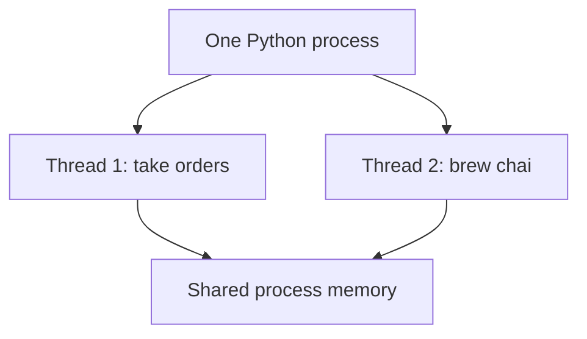
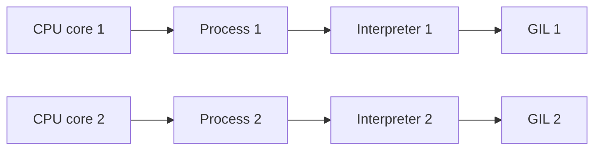
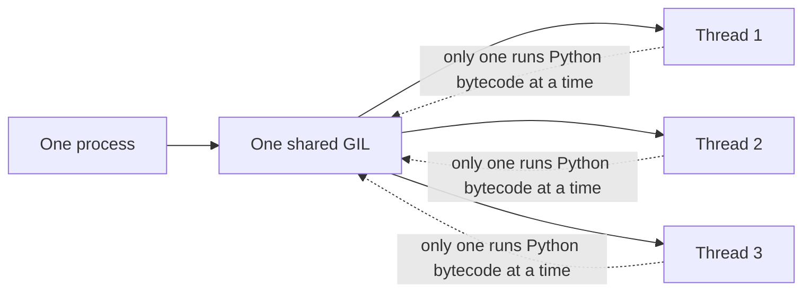
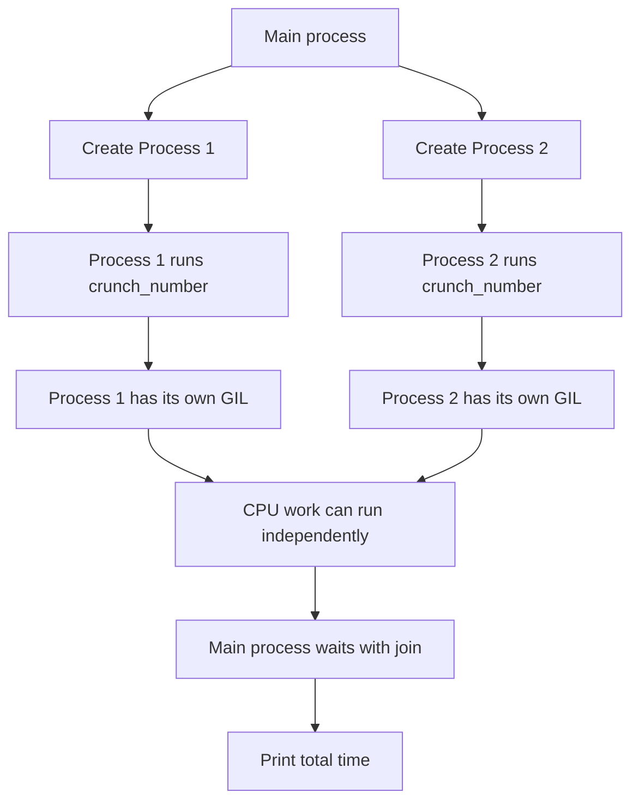
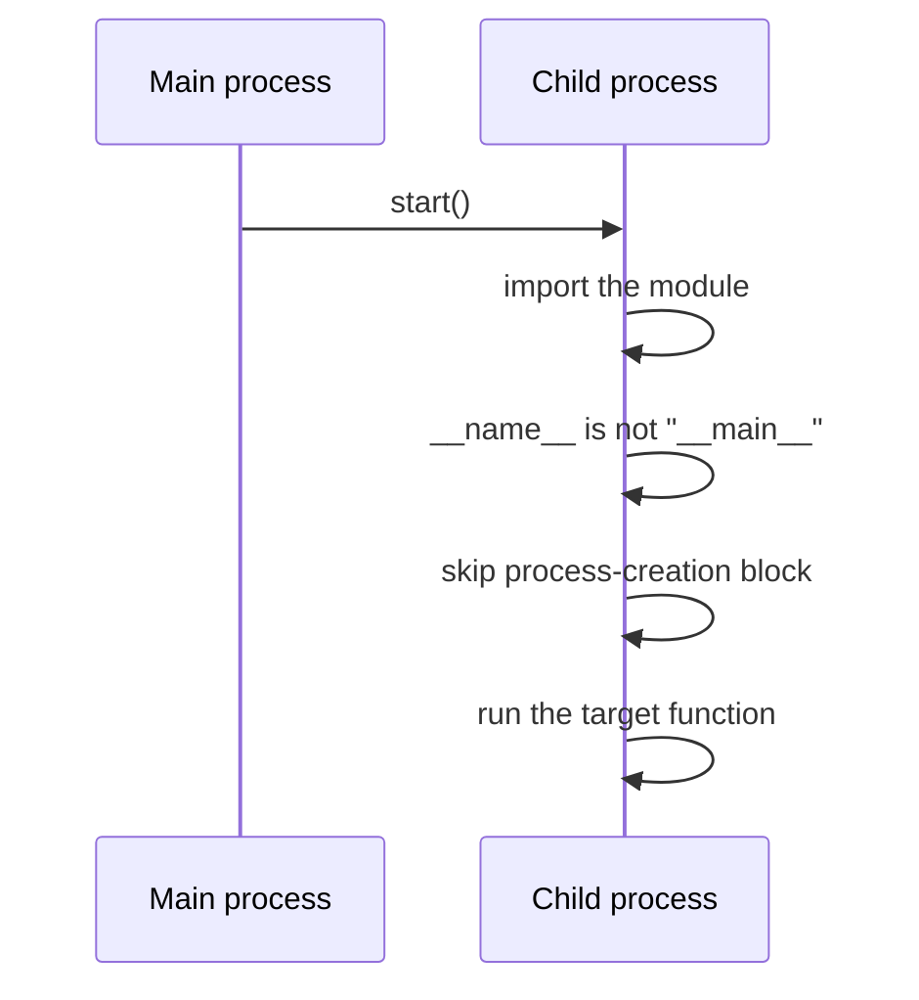
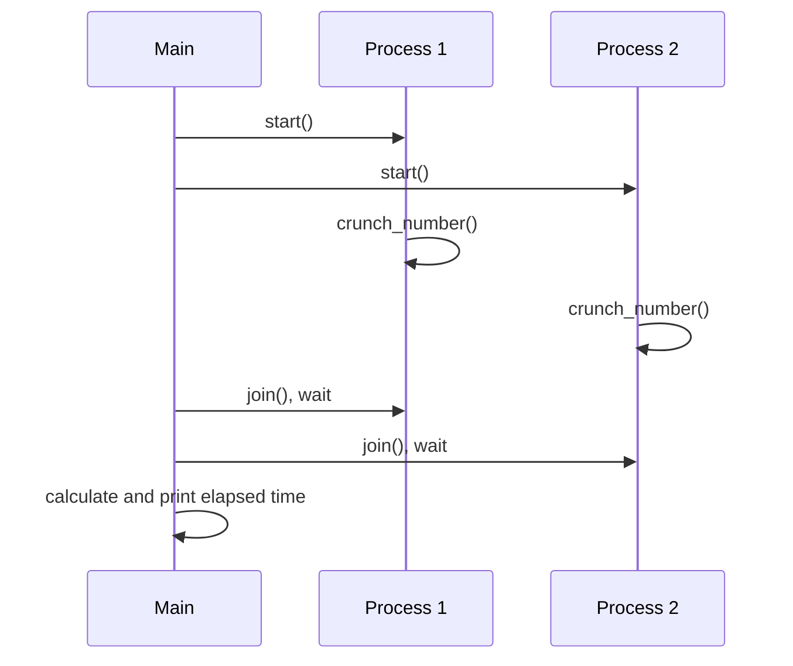
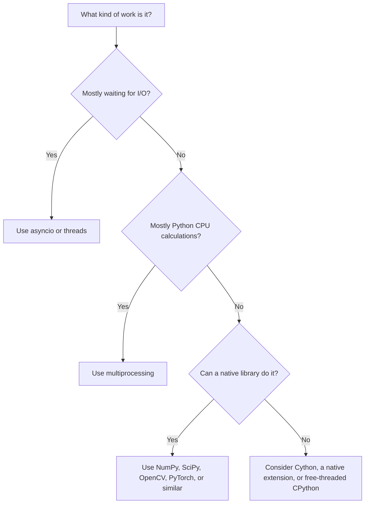

# Concurrency in Python: Threads, Processes, and the GIL

This folder demonstrates two ways to run work concurrently in Python:

- **Multithreading**: multiple threads inside one process.
- **Multiprocessing**: multiple independent processes.

The examples use a chai-brewing story, but the same ideas apply to web requests, file operations, data processing, and CPU-heavy calculations.

## 1. Concurrency and Parallelism

**Concurrency** means that multiple tasks are in progress during the same period. The operating system switches between them when necessary.

**Parallelism** means that multiple tasks are executing at the same time, usually on different CPU cores.



A program can be concurrent without being truly parallel. Standard CPython threads are the main example for CPU-bound Python code because of the GIL.

## 2. Multithreading

A process can contain several threads. Threads share the process's memory and resources.



The example in `01_threading.py` starts two threads:

```python
order_thread = threading.Thread(target=take_order)
brew_thread = threading.Thread(target=make_chai)

order_thread.start()
brew_thread.start()

order_thread.join()
brew_thread.join()
```

`start()` begins the thread's work. `join()` makes the main thread wait until that worker has finished.

### When threads are useful

Threads are a good fit for **I/O-bound work**, where a task spends time waiting for something else:

- Network requests
- Reading and writing files
- Database queries
- Waiting for APIs or user input

While one thread waits for I/O, another thread can make progress.

```text
Thread 1: send request ---- waiting ---- process response
Thread 2:                  read file -- waiting -- process file
```

## 3. Multiprocessing

Multiprocessing creates multiple independent processes. Each process normally has its own Python interpreter, memory space, and GIL.



The example in `02_multiproccesing.py` creates three processes. Each process brews a separate chai, then the parent waits for all of them with `join()`.

```python
if __name__ == "__main__":
    chai_makers = [
        Process(target=brew_chai, args=(f"Chai maker #{i + 1}",))
        for i in range(3)
    ]

    for process in chai_makers:
        process.start()

    for process in chai_makers:
        process.join()
```

### When processes are useful

Processes are a good fit for **CPU-bound work**, where the program spends most of its time calculating:

- Large numerical calculations
- Image or video processing
- Machine-learning workloads
- CPU-heavy parsing or transformations

Processes have more overhead than threads and do not automatically share variables. Data must be passed between processes using mechanisms such as queues, pipes, shared memory, or a process pool.

## 4. What Is the GIL?

The **Global Interpreter Lock**, or GIL, is a lock in standard CPython that generally allows only one thread at a time to execute Python bytecode within a process.



The GIL does **not** mean that threads never overlap. Threads can overlap while waiting for I/O, and many native libraries release the GIL during their heavy computation. The limitation mainly affects CPU-bound Python bytecode.

## 5. Why the CPU Thread Example Does Not Scale Well

`03_gil_threading.py` runs the same CPU-heavy loop in two threads:

```python
for _ in range(100_000_000):
    count += 1
```

Both threads share one process and therefore compete for the same GIL:

```text
One process
    |
    +-- Shared GIL
          |
          +-- Thread 1 runs Python bytecode
          +-- Thread 2 waits, then gets a turn
          +-- Thread 1 waits, then gets a turn
```

The operating system may schedule both threads, but standard CPython does not normally execute their Python bytecode on two CPU cores simultaneously. Thread switching also adds overhead, so two threads may be no faster than one thread for this workload.

## 6. Why Multiprocessing Helps with the GIL

`04_gil_multiprocces.py` runs the CPU-heavy loop in two separate processes:

```python
p1 = Process(target=crunch_number)
p2 = Process(target=crunch_number)
p1.start()
p2.start()
p1.join()
p2.join()
```

The execution looks like this:



On a machine with at least two available CPU cores, the timeline can look like this:

```text
Time -------------------------------------------------->

Process 1:  [ crunch_number: 100,000,000 iterations ]
Process 2:  [ crunch_number: 100,000,000 iterations ]
CPU core 1: [ Process 1                               ]
CPU core 2: [ Process 2                               ]
```

This bypasses the GIL for the workload because the two processes do not share one GIL. It does not guarantee a perfect 2x speedup: process startup, CPU availability, memory pressure, and operating-system scheduling all affect the result.

## 7. Why `if __name__ == "__main__":` Matters

The guard is important for multiprocessing, especially on Windows:

```python
if __name__ == "__main__":
    # Create and start processes here
```

On Windows, a child process starts a fresh Python interpreter and imports the module. The guard prevents the child from executing the parent code that creates more children.



Without the guard, the program can recursively create processes or raise a multiprocessing startup error.

## 8. What `join()` Does

`join()` does not make tasks run sequentially. Calling `start()` first allows the workers to run; calling `join()` afterward only waits for them to finish.



## 9. Threads Versus Processes

| Feature | Multithreading | Multiprocessing |
|---|---|---|
| Execution units | Multiple threads | Multiple processes |
| Typical structure | One process with many threads | Parent process with child processes |
| Memory | Shared memory | Separate memory by default |
| Startup cost | Lower | Higher |
| Communication | Easy to share objects, but synchronization is needed | Requires queues, pipes, pools, or shared memory |
| Standard CPython CPU work | Usually limited by the GIL | Can run Python work on multiple cores |
| Best use | I/O-bound tasks | CPU-bound tasks |
| Failure isolation | Lower | Higher, because processes are isolated |

So multiprocessing is **not** "one thread." Each process normally starts with its own main thread, so your example uses two processes and at least two main threads in total:

```text
Main process
    +-- Process 1
    |     +-- Main thread running crunch_number()
    +-- Process 2
          +-- Main thread running crunch_number()
```

## 10. Other Ways to Work Around the GIL

Multiprocessing is not the only option:

### Native libraries

Libraries written in C, C++, or Rust can release the GIL while doing heavy work. NumPy, SciPy, OpenCV, PyTorch, and some compression or database libraries use native code.


### Cython

Cython can compile performance-critical code and use `with nogil` for code that does not access normal Python objects. `prange` can help parallelize suitable loops.

```cython
with nogil:
    # Work here must use compatible native types
    for i in range(size):
        total += values[i]
```

### Native extensions

A custom extension written in C, C++, or Rust can expose a Python function and release the GIL during its CPU-heavy section. This is useful when an existing library cannot solve the problem.

### Free-threaded CPython

Some recent CPython builds support an optional free-threaded mode. In that mode, multiple threads can execute Python code in parallel. Compatibility and performance depend on the Python version and third-party packages, so this should be evaluated for the specific project.

### Other Python implementations

Jython and IronPython use different runtimes and do not use CPython's GIL in the same way. Their compatibility with CPython packages may be limited.

## 11. What Does Not Bypass the GIL?

`asyncio` improves concurrency for I/O, but it does not make CPU-heavy Python code execute in parallel:

```python
async def crunch_number():
    # A CPU-heavy loop still occupies the interpreter while it runs.
    pass
```

Use `asyncio` for many waiting tasks, such as network requests. Use multiprocessing, native libraries, Cython, or free-threaded Python for CPU parallelism.

## 12. Practical Decision Guide



### Short rule

- **I/O-bound work**: use threads or `asyncio`.
- **CPU-bound pure Python work**: use multiprocessing.
- **CPU-heavy library work**: use a native library that can release the GIL.
- **Custom high-performance work**: consider Cython, C/C++, Rust, or free-threaded CPython.
