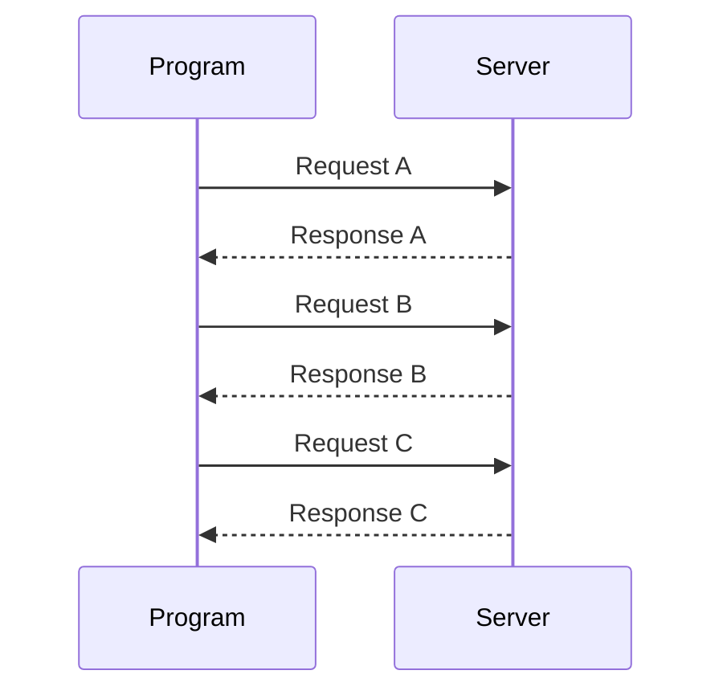
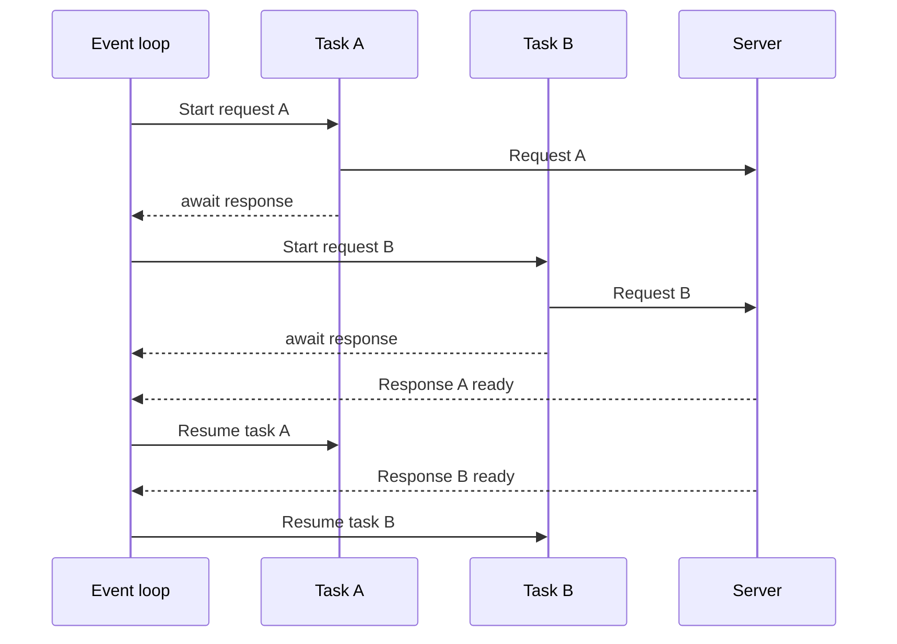
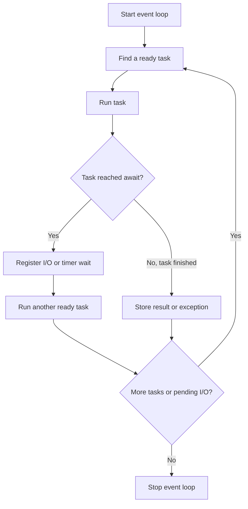
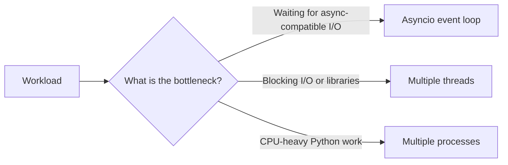

# Asynchronous Programming in Python

Asynchronous programming allows a program to start an operation that may take time, pause while that operation is waiting, and work on another operation during the pause. It is especially useful for I/O-bound work such as network requests, file operations, database queries, and timers.

This directory contains examples for learning Python's `asyncio` library:

- [`01_asyncio_one.py`](01_asyncio_one.py) - defines and runs a coroutine
- [`02_async_two.py`](02_async_two.py) - runs several coroutines concurrently
- [`03_async_three.py`](03_async_three.py) - performs concurrent HTTP requests with `aiohttp`

## What Asynchronous Programming Means

A synchronous program normally waits for each operation to finish before starting the next one:



An asynchronous program can pause a task while it is waiting and let another task use the event loop:



This is concurrency, not automatically parallel execution. The program makes progress on multiple tasks during the same period, but one event-loop thread normally runs Python code at a time.

## Important Terms

### Coroutine

A coroutine is an asynchronous function declared with `async def`. Calling it creates a coroutine object; it does not run the function immediately.

```python
import asyncio

async def say_hello():
    print("Hello")

asyncio.run(say_hello())
```

### `await`

`await` pauses the current coroutine until another awaitable operation completes. While it is paused, the event loop can run other ready tasks.

```python
async def wait_for_data():
    data = await receive_data()
    return data
```

`await` can only be used inside an `async def` function, and the object being awaited must be awaitable, such as a coroutine, task, or future.

### Event Loop

The event loop is the scheduler that:

1. Runs a coroutine until it reaches `await`.
2. Suspends that coroutine while it waits for I/O or a timer.
3. Runs another ready task.
4. Resumes the suspended coroutine when its operation is ready.



### Task

A task schedules a coroutine to run on the event loop. Use `asyncio.create_task()` when work should begin while the current coroutine continues doing other work.

```python
async def main():
    first = asyncio.create_task(download("one"))
    second = asyncio.create_task(download("two"))

    result_one = await first
    result_two = await second
```

A coroutine passed directly to `asyncio.gather()` is also scheduled and run concurrently.

### Future

A future represents a result that is not available yet. Tasks are a higher-level form of future used to manage coroutines. Most application code uses tasks and does not need to create futures manually.

## Running Coroutines Concurrently

`asyncio.gather()` waits for multiple awaitables and returns their results in the same order in which they were supplied:

```python
import asyncio

async def brew(name):
    print(f"Starting {name}")
    await asyncio.sleep(2)
    return f"{name} is ready"

async def main():
    results = await asyncio.gather(
        brew("Masala chai"),
        brew("Ginger tea"),
        brew("Green tea"),
    )
    print(results)

asyncio.run(main())
```

The three two-second waits overlap, so the operation takes about two seconds rather than six. `asyncio.sleep()` is non-blocking and gives control back to the event loop.

## The `asyncio` Library

`asyncio` is Python's standard-library framework for asynchronous, event-driven programming. Common APIs include:

| API | Purpose |
| --- | --- |
| `asyncio.run()` | Start an event loop, run the top-level coroutine, and close the loop |
| `asyncio.sleep()` | Wait without blocking other asyncio tasks |
| `asyncio.create_task()` | Schedule a coroutine as a task |
| `asyncio.gather()` | Run several awaitables concurrently and collect results |
| `asyncio.wait_for()` | Apply a timeout to one awaitable |
| `asyncio.timeout()` | Context manager for a timeout block in modern Python |
| `asyncio.TaskGroup` | Structured concurrency for related tasks |
| `asyncio.Queue` | Safely pass work between async producers and consumers |
| `asyncio.Lock` | Protect a shared async resource |
| `asyncio.Semaphore` | Limit the number of concurrent operations |
| `asyncio.Event` | Notify tasks that a condition has occurred |

### Structured Concurrency with `TaskGroup`

`TaskGroup` keeps related tasks together and cancels the group when one task fails:

```python
import asyncio

async def main():
    async with asyncio.TaskGroup() as group:
        task_one = group.create_task(fetch("one"))
        task_two = group.create_task(fetch("two"))

    print(task_one.result())
    print(task_two.result())

asyncio.run(main())
```

Use a `TaskGroup` when a group of operations belongs to one unit of work and should be managed together.

### Exceptions and Cancellation

Exceptions raised by awaited tasks should be handled explicitly when the failure is expected:

```python
async def main():
    try:
        result = await asyncio.wait_for(fetch_data(), timeout=5)
    except TimeoutError:
        print("The request took too long")
    except ConnectionError:
        print("The server could not be reached")
```

Tasks can be cancelled with `task.cancel()`. Async functions should generally allow `asyncio.CancelledError` to propagate after cleaning up resources:

```python
async def worker():
    try:
        await do_work()
    except asyncio.CancelledError:
        await close_resources()
        raise
```

### Async Context Managers and Iterators

Libraries often provide `async with` for resources that require asynchronous setup and cleanup, such as HTTP sessions:

```python
async with aiohttp.ClientSession() as session:
    async with session.get("https://example.com") as response:
        body = await response.text()
```

An asynchronous iterator uses `async for` when each next item may require waiting:

```python
async for message in message_stream():
    print(message)
```

## Avoid Blocking the Event Loop

This blocks every other asyncio task during the sleep:

```python
import time

time.sleep(3)
```

Use the non-blocking alternative inside async code:

```python
await asyncio.sleep(3)
```

For unavoidable blocking functions, move them to a worker thread or process:

```python
result = await asyncio.to_thread(blocking_function, argument)
```

Do not use blocking libraries such as `requests` directly in an async task for frequent network operations. Prefer an async client such as `aiohttp`, or isolate the blocking call with `asyncio.to_thread()`.

## Asyncio vs Multithreading vs Multiprocessing

These approaches solve different problems:



| Feature | Asynchronous programming | Multithreading | Multiprocessing |
| --- | --- | --- | --- |
| Main unit | Coroutine/task | Thread | Process |
| Memory | Shared within the event-loop process | Shared memory within a process | Separate memory spaces |
| Scheduling | Cooperative: tasks yield at `await` | Operating-system scheduled | Operating-system scheduled |
| Best for | Many async network or I/O operations | Blocking I/O and libraries that release the GIL | CPU-bound work and true parallelism |
| Python code running at once | Usually one event-loop thread | Limited by the GIL for normal Python bytecode | Multiple CPU cores can run Python code |
| Communication | Async queues and task results | Queues, events, locks | Queues, pipes, shared values, managers |
| Overhead | Low per task | More memory and scheduling overhead | Highest startup and communication overhead |
| Common risks | Blocking the event loop, forgotten awaits | Race conditions, deadlocks | Serialization cost, process startup, shared-state complexity |

### Asynchronous Programming

- Usually uses one thread and one event loop.
- Tasks voluntarily give up control at `await` points.
- Can handle many network connections efficiently.
- Does not make CPU-heavy code faster by itself.
- Requires async-compatible libraries or an explicit thread handoff.

### Multithreading

- Multiple threads share the process's memory.
- Useful when operations block, for example a synchronous network or file API.
- Threads may run concurrently, but the CPython GIL generally prevents parallel execution of Python bytecode in CPU-bound threads.
- Shared mutable data requires synchronization such as `threading.Lock`.

### Multiprocessing

- Each process has its own Python interpreter and memory.
- Suitable for CPU-bound tasks because processes can execute on separate CPU cores.
- Data must usually be serialized when sent between processes.
- More expensive to start and coordinate than coroutines or threads.

## Choosing an Approach

| Situation | Recommended approach |
| --- | --- |
| Thousands of HTTP requests using an async client | `asyncio` |
| A small number of blocking API calls | Threads or `asyncio.to_thread()` |
| Image processing, numerical computation, or CPU-heavy loops | Multiprocessing |
| A web server with async framework and async database driver | `asyncio` |
| A synchronous library that cannot be replaced | Threads |
| Independent CPU-heavy jobs | Multiprocessing |
| Mixed application | Combine them carefully, keeping each kind of work in the appropriate executor |

The key question is whether the program spends most of its time waiting or computing. Asyncio improves throughput during waits; multiprocessing provides parallel CPU execution; threads are a practical bridge for blocking work.

## HTTP Example in This Directory

`03_async_three.py` creates one `aiohttp.ClientSession`, builds several request coroutines, and passes them to `asyncio.gather()`:

```python
async with aiohttp.ClientSession() as session:
    tasks = [fetch_url(session, url) for url in urls]
    await asyncio.gather(*tasks)
```

The requests can overlap while each response is in transit. Reusing one client session is more efficient than creating a new session for every request.

Install the project dependencies from the repository root and run it with:

```bash
uv sync
uv run 13_asyncio/03_async_three.py
```

You can also run the examples with an activated virtual environment:

```bash
python 13_asyncio/01_asyncio_one.py
python 13_asyncio/02_async_two.py
python 13_asyncio/03_async_three.py
```

## Common Mistakes

1. Calling a coroutine without awaiting or scheduling it:
   ```python
   fetch_data()  # Creates a coroutine but does not run it
   ```
2. Using `time.sleep()` or another blocking function inside an async task.
3. Creating a new HTTP session for every request instead of reusing a session.
4. Starting multiple event loops unnecessarily. Usually one `asyncio.run()` call at the application entry point is enough.
5. Assuming concurrency means parallel CPU execution.
6. Sharing mutable state between tasks without considering race conditions around `await` points.
7. Forgetting to close async resources. Prefer `async with` when the library supports it.

## Summary

- Use `async def` to define coroutines.
- Use `await` to pause a coroutine and let other tasks run.
- Use `asyncio.run()` at the top-level entry point.
- Use `create_task()`, `gather()`, or `TaskGroup` to coordinate concurrent work.
- Keep blocking operations out of the event loop.
- Choose asyncio for async-compatible I/O, threads for blocking I/O, and processes for CPU-bound work.
