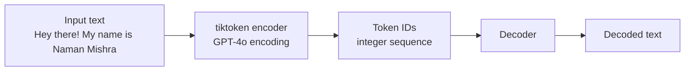
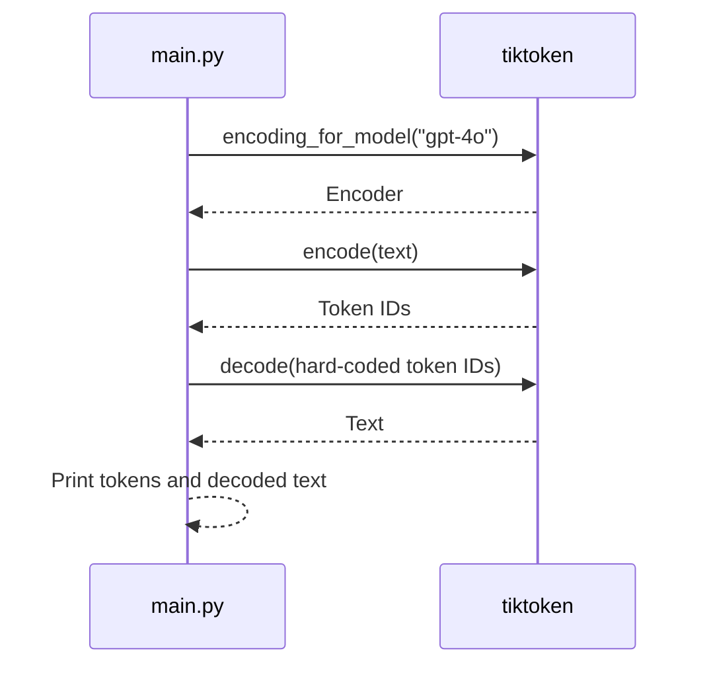

# Tokenization with `tiktoken`

This example demonstrates how text is converted into model-oriented token IDs and how token IDs can be decoded back into text. Tokenization is the boundary between human-readable text and the numerical input representation used by language models.

## Architecture



## Runtime Flow



1. `encoding_for_model("gpt-4o")` selects the tokenizer associated with the model family.
2. `encode(text)` converts the sample sentence into integers.
3. `decode(token_ids)` reconstructs text from a token sequence.
4. The script prints both results.

## Run

From this directory:

```powershell
python main.py
```

No API key, network service, or model server is required. The tokenizer runs locally through the `tiktoken` package.

## Key Concepts

- A token may be a complete word, part of a word, punctuation, whitespace, or another text fragment.
- Token counts affect context-window usage, latency, and API cost.
- Encoding is not always character-based or word-based.
- Use the tokenizer associated with the target model when estimating prompt size.
- Decoding arbitrary token IDs may produce unexpected text or fail if IDs are invalid for the encoding.

## Revision Notes

```text
Text -> encode -> token IDs -> model input
Token IDs -> decode -> text
```

The current script uses a fixed sentence for encoding and a separate hard-coded token list for decoding; the decoded list is not generated from the sentence in the same run.

## Possible Extensions

- Print the token count with `len(tokens)`.
- Compare tokenization across model encodings.
- Measure how punctuation, whitespace, and non-English text affect token counts.
- Add a helper that estimates the token budget of a prompt before sending it to an API.
