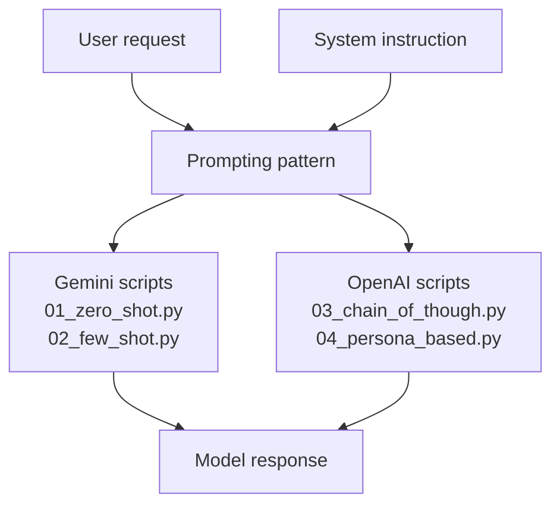
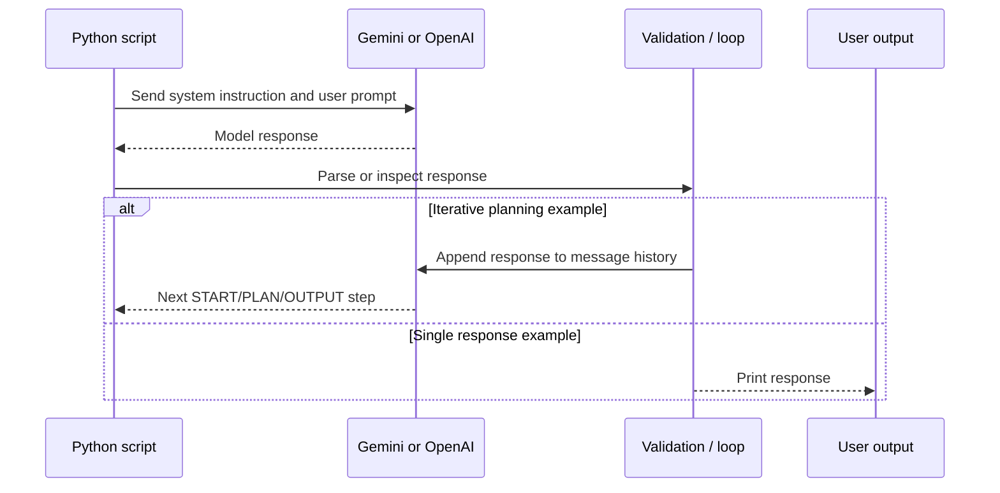
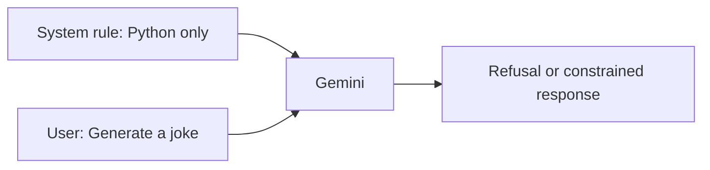

# Prompting Patterns

This folder contains small experiments with prompt design across Gemini and OpenAI models. The examples progress from a basic instruction to few-shot structured output, iterative planning, and persona-based prompting.

## Folder Architecture



## Examples at a Glance

| File | Pattern | Provider | Main idea |
| --- | --- | --- | --- |
| `01_zero_shot.py` | Zero-shot | Gemini | Give an instruction without examples. |
| `02_few_shot.py` | Few-shot and structured output | Gemini | Use examples and request a JSON-shaped response. |
| `03_chain_of_though.py` | Iterative planning | OpenAI | Continue `START`/`PLAN` messages until `OUTPUT`. |
| `04_persona_based.py` | Persona/system prompt | OpenAI | Set an expert role before asking a question. |
| `output_json_few_shot.json` | Example output | None | Reference shape for the few-shot response. |
| `prompt_style.md` | Prompt format notes | None | Reference formats used by several model families. |

## Prompting Flow



## 1. Zero-Shot Prompting

`01_zero_shot.py` sends a system instruction telling Gemini to output only Python code. The user request is a joke, so the intended behavior is a refusal because the request is outside the instructed domain.



Zero-shot prompting relies on instructions alone; there are no examples of the expected answer.

## 2. Few-Shot Structured Prompting

`02_few_shot.py` adds examples and a requested output shape containing:

```json
{
  "code": "string",
  "iscoddingQuestion": true,
  "explanation": "string",
  "flow_diagram": "string"
}
```

The examples teach the model how to handle allowed and disallowed questions. `output_json_few_shot.json` is a reference artifact for the expected structure.

## 3. Iterative Planning

`03_chain_of_though.py` asks OpenAI for one JSON step at a time:

```text
START -> PLAN -> PLAN -> ... -> OUTPUT
```

After every response, the script appends the JSON response to `messages` and calls the model again. The loop stops when `step` equals `OUTPUT` or an exception occurs.

> The filename `03_chain_of_though.py` is retained as-is from the project, including its existing spelling.

## 4. Persona-Based Prompting

`04_persona_based.py` sets a system role before asking for an explanation of DFS. It demonstrates that the same user question can be shaped by role, audience, tone, and expertise instructions.

The current script sends the request but does not print the response.

## Configuration and Run

Create the required provider credentials in the environment or `.env` file used by the SDKs. Then run an individual example from this directory:

```powershell
python 01_zero_shot.py
python 02_few_shot.py
python 03_chain_of_though.py
python 04_persona_based.py
```

## Prompt Design Checklist

```text
[ ] Define the task and allowed scope
[ ] Specify the audience and desired tone
[ ] Give an explicit output format when parsing is needed
[ ] Add examples when the format or policy is subtle
[ ] Validate model output before using it as data
[ ] Bound iterative loops and handle malformed JSON
[ ] Avoid assuming a prompt instruction guarantees factual accuracy
```

## Possible Extensions

- Use provider-native structured output instead of parsing free-form JSON.
- Add a maximum number of planning iterations.
- Print and validate the persona example response.
- Correct and standardize field names such as `iscoddingQuestion` before using them in an application.
