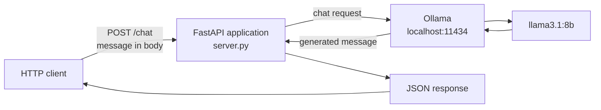
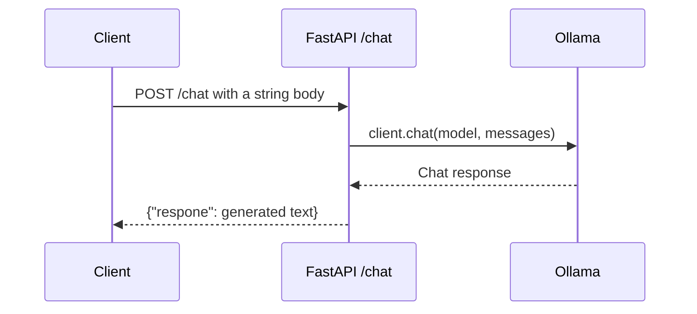

# Ollama Chat API with FastAPI

This example is intended to expose a local Ollama chat model through a small FastAPI HTTP service. A client sends a message to `POST /chat`; the server forwards it to Ollama and returns the generated text.

## Intended Architecture



## Request Lifecycle



## Intended API Contract

### `POST /chat`

Request body: a plain string, for example:

```json
"Explain recursion simply"
```

Response shape:

```json
{
  "respone": "Generated answer from Ollama"
}
```

The response key is currently spelled `respone` in the source and is documented here to match the implementation.

## Run

1. Start Ollama.
2. Pull the configured model:

```powershell
ollama pull llama3.1:8b
```

3. Start the API with Uvicorn. The current file defines `app` but does not include a `__main__` runner, so use:

```powershell
uvicorn server:app --reload
```

4. Send a request from another terminal:

```powershell
Invoke-RestMethod `
  -Method Post `
  -Uri http://localhost:8000/chat `
  -ContentType "application/json" `
  -Body '"Explain recursion simply"'
```

## Current Code Issue

The `messages` entry in `server.py` contains an extra quote after the `"user"` key. Python will fail to import the module until that syntax error is corrected. The intended message entry is:

```python
{"role": "user", "content": message}
```

This README describes the intended architecture without changing the learning example.

## Revision Notes

- FastAPI handles HTTP transport and validation.
- Ollama remains a separate local service.
- The endpoint is synchronous: the request remains open until Ollama returns.
- There is no authentication, request limit, timeout, streaming response, or explicit error mapping yet.
- The Ollama URL and model name are hard-coded in `server.py`.

## Possible Extensions

- Fix the syntax error and rename `respone` to `response`.
- Move the Ollama URL and model name to environment variables.
- Add a Pydantic request model and response model.
- Add timeout handling and friendly Ollama errors.
- Add streaming tokens for long responses.
- Add a health endpoint that checks Ollama availability.
