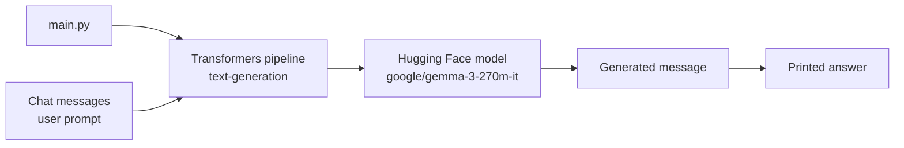
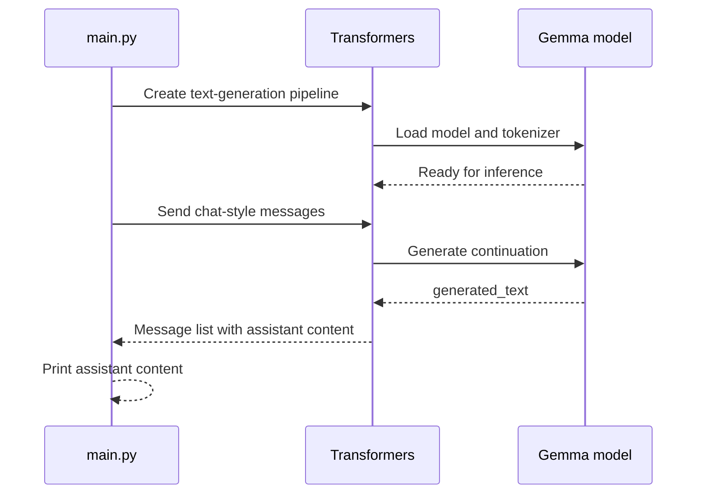

# Local Text Generation with Hugging Face Transformers

This example uses the Hugging Face Transformers pipeline API to run a small instruction-tuned model locally. It sends a chat-style message asking for DFS and BFS code with an ELI5 explanation, then prints the assistant response.

## Architecture



## Runtime Flow



## What the Code Does

1. Creates a `text-generation` pipeline.
2. Loads `google/gemma-3-270m-it` through Transformers.
3. Supplies a message asking for DFS and BFS code with an ELI5 explanation.
4. Reads the generated chat result from `result[0]["generated_text"][1]["content"]`.
5. Prints the assistant content.

## Run

From this directory:

```powershell
python main.py
```

The first run may download model and tokenizer files from Hugging Face and may require significant disk space, memory, and download time. Later runs can use the local cache.

## Local Inference Notes

- No hosted inference API is called explicitly by this script.
- The model runs through the local Transformers runtime.
- CPU inference may be slow; GPU support depends on the installed PyTorch environment.
- Chat-style output depends on the model and Transformers version supporting the supplied message format.
- The generated response is not fact-checked or executed by the script.

## Revision Checklist

```text
[ ] Transformers and PyTorch are installed
[ ] Model download completed successfully
[ ] The selected model supports the text-generation task
[ ] The prompt format matches the model's chat template
[ ] Output indexing still matches the returned structure
[ ] Generated code is reviewed before execution
```

## Possible Extensions

- Add a command-line question instead of a fixed prompt.
- Set generation controls such as `max_new_tokens`, `temperature`, and `do_sample`.
- Use `apply_chat_template` explicitly when a model requires it.
- Save the generated response to a file for comparison.
- Add a small evaluation set for code correctness and explanation quality.
