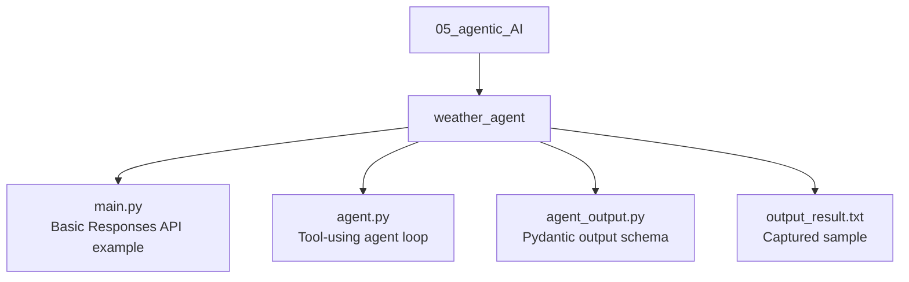
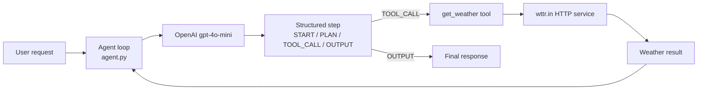
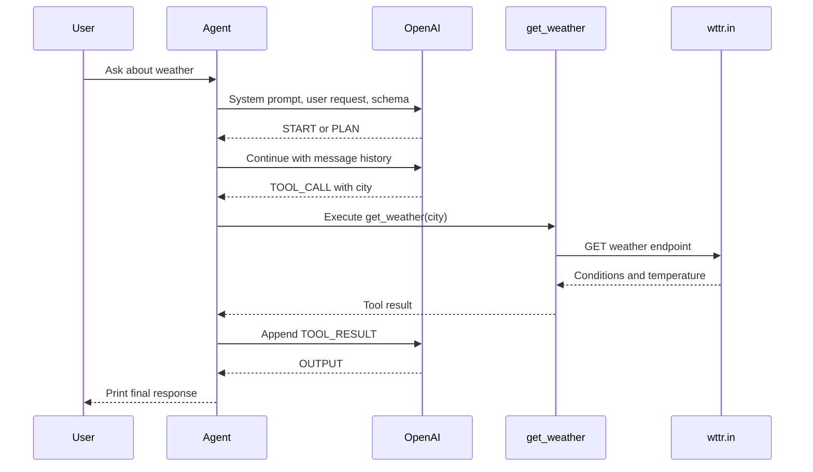
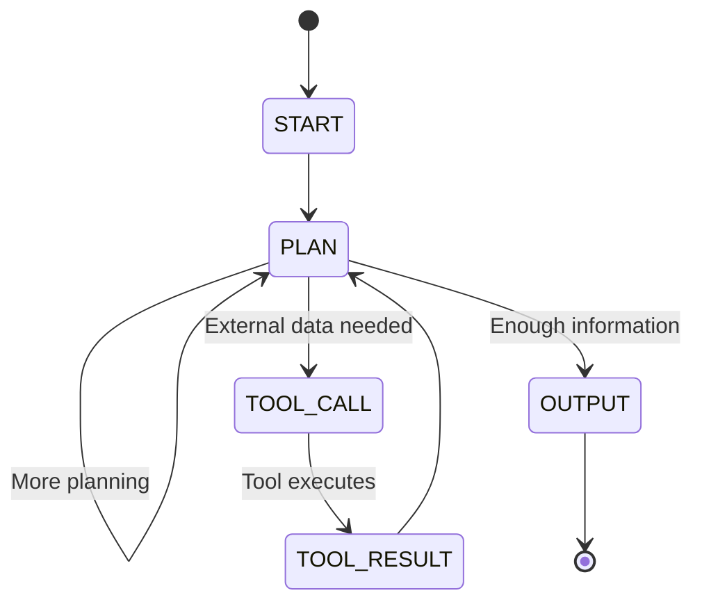

# Agentic AI Examples

This folder contains an agent experiment centered on a weather tool. The implementation lives in the nested `weather_agent` folder and demonstrates how an LLM can plan, call an external function, receive the tool result, and produce a final answer.

## Folder Architecture



## Agent Architecture



## Two Learning Paths

| File | Purpose |
| --- | --- |
| `weather_agent/main.py` | Basic OpenAI Responses API call. It reads one message and prints `output_text`. |
| `weather_agent/agent.py` | Full structured agent loop with planning and the `get_weather` tool. |
| `weather_agent/agent_output.py` | Pydantic schema used to parse the model's step output. |
| `weather_agent/output_result.txt` | Captured sample output for revision. |

## Tool-Calling Lifecycle



## Agent State Model



## Run

Create an OpenAI API key in the environment or `.env` file expected by the OpenAI SDK. Run from the nested folder:

```powershell
cd weather_agent
python main.py
```

This runs the basic Responses API example. To run the tool-using agent:

```powershell
python agent.py
```

Enter a request such as:

```text
What is the weather in Delhi?
```

The agent may call `https://wttr.in/<city>?format=%C+%t` to fetch the current result.

## Key Design Ideas

- An agent is a model-driven loop, not just one model call.
- Structured output gives the application a predictable step contract.
- Tools extend the model with actions or data it cannot provide reliably by itself.
- Tool results must be added back to the conversation before the final response.
- The application, not the model, executes the Python tool.

## Current Limitations

- The tool call is selected from model text and parsed with `json.loads`.
- Network errors, timeouts, invalid cities, and non-JSON model output are handled only by the broad exception path.
- There is no maximum iteration count, so a production agent needs a loop guard.
- `get_weather` uses a public service and should not be treated as a guaranteed production data source.
- The system prompt contains several spelling mistakes and duplicated step labels, but the intended state flow is clear.

## Possible Extensions

- Add a maximum number of agent turns.
- Add explicit tool schemas and provider-native tool calling.
- Validate city input and set an HTTP timeout.
- Return structured final answers with source and retrieval time.
- Add logging, retries, and tests for each state transition.
