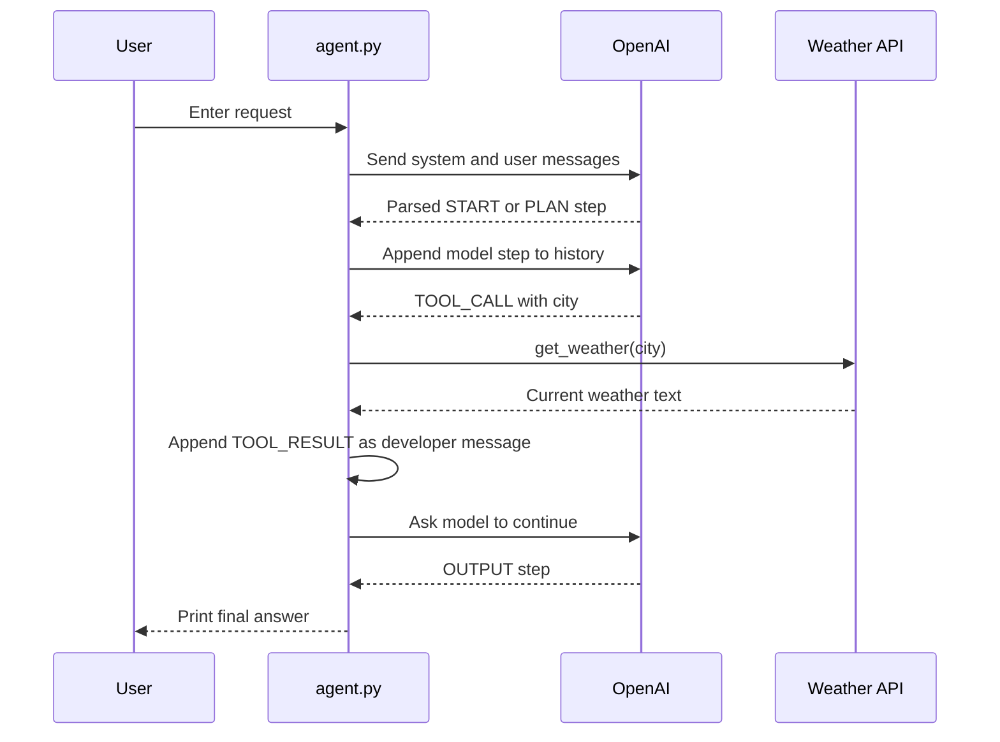

# Weather Agent

This folder contains two OpenAI examples: a basic response call and a structured agent that can call a weather function. The agent uses an iterative state protocol to decide whether to plan, call `get_weather`, process the tool result, or finish.

## Architecture

```mermaid
flowchart LR
    U[User input]
    A[agent_invoke]
    L[OpenAI Responses API\nresponses.parse]
    P[Pydantic myOutputFormat]
    T[AVAILABLE_TOOLS]
    W[get_weather(city)]
    X[wttr.in]
    R[TOOL_RESULT]
    O[OUTPUT]

    U --> A --> L --> P
    P -->|TOOL_CALL| T --> W --> X --> R --> A
    P -->|OUTPUT| O
```

## Files

| File | Responsibility |
| --- | --- |
| `main.py` | Basic `responses.create` example and reusable `get_weather` helper. |
| `agent.py` | Structured agent loop, tool dispatch, message history, and terminal output. |
| `agent_output.py` | Pydantic model describing the parsed agent step. |
| `output_result.txt` | Saved sample transcript. |

## Agent Loop



## Structured Output Contract

`myOutputFormat` defines these fields:

```json
{
  "step": "START | PLAN | TOOL_CALL | TOOL_RESULT | OUTPUT",
  "content": "optional text",
  "tool": "optional tool name",
  "input": "optional tool input"
}
```

The active tool registry is:

```text
get_weather -> get_weather(city: str)
```

The model suggests a tool call, but Python performs the actual lookup and execution through `AVAILABLE_TOOLS`.

## Run

Set an OpenAI API key in the environment or `.env` file, then run:

```powershell
python agent.py
```

Example input:

```text
> What is the weather in London?
```

The tool calls `https://wttr.in/London?format=%C+%t` and returns the result to the agent.

To run the basic non-agent example:

```powershell
python main.py
```

## Important Implementation Notes

- `agent.py` imports `myOutputFormat` as a local module, so run it from this directory.
- The model response is converted from `response.output_text` into a Python dictionary with `json.loads`.
- The conversation history is preserved in `messages` so the model can use the tool result.
- The loop stops only when the parsed step is `OUTPUT` or an exception occurs.
- The current implementation prints the full `messages` list at the end.

## Reliability and Security Checklist

```text
[ ] Add a maximum loop count
[ ] Add a timeout to requests.get
[ ] Validate the city and URL input
[ ] Handle non-200 responses correctly
[ ] Handle malformed model JSON
[ ] Restrict tool names to the allow-list
[ ] Avoid exposing secrets in logs
[ ] Add tests for TOOL_CALL and OUTPUT transitions
```

## Possible Improvements

- Use provider-native function/tool calling instead of instructing the model to emit tool JSON.
- Use a typed enum for `step` and validate the tool input.
- Add retries for temporary weather API failures.
- Return a final structured response rather than only terminal text.
