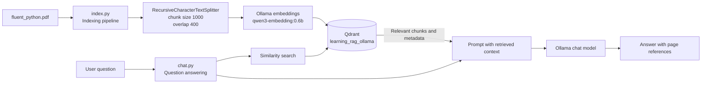
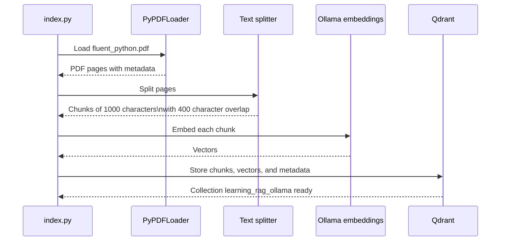
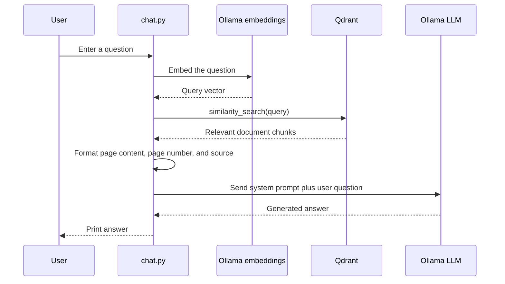
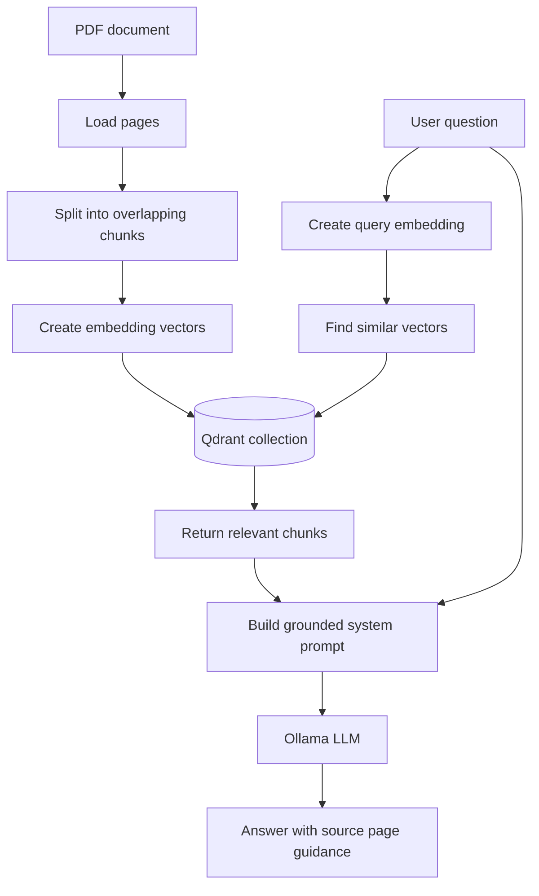

# Local PDF RAG with Qdrant and Ollama

This example builds a simple Retrieval-Augmented Generation (RAG) application over `fluent_python.pdf`. The indexing script converts the PDF into searchable vector records in Qdrant. The chat script retrieves the most relevant chunks for a question and gives those chunks to an Ollama chat model as context.

The flow is intentionally split into two commands:

1. **Indexing:** PDF -> pages -> chunks -> embeddings -> Qdrant.
2. **Question answering:** question -> embedding search -> context prompt -> Ollama answer.

## What RAG Means Here

RAG combines retrieval with generation:

- **Retrieval** finds relevant source text from the vector database.
- **Augmentation** adds that source text to the LLM prompt.
- **Generation** asks the LLM to answer using the supplied context.

This lets the model answer about the PDF without placing the entire document in every prompt.

## Architecture



### Component Responsibilities

| Component | Responsibility |
| --- | --- |
| `fluent_python.pdf` | Source knowledge document. |
| `index.py` | Loads, chunks, embeds, and stores PDF content. |
| `chat.py` | Reads the existing collection, retrieves context, and generates an answer. |
| `../../docker-compose.yml` | Starts the shared Ollama, Qdrant, and Valkey services. |
| Qdrant | Stores vectors, chunk text, and document metadata. |
| Ollama | Creates embeddings and generates the final response. |
| LangChain integrations | Connect the loader, splitter, embeddings, and Qdrant store. |

## Indexing Pipeline

Run indexing after starting Qdrant and whenever the source document changes.



### Indexing Details

1. `Path(__file__).parent / "fluent_python.pdf"` resolves the source PDF beside `index.py`.
2. `PyPDFLoader` loads the PDF into page-level documents.
3. `RecursiveCharacterTextSplitter` creates chunks with:
   - `chunk_size=1000`
   - `chunk_overlap=400`
4. `OllamaEmbeddings` uses `qwen3-embedding:0.6b` at `http://localhost:11434/`.
5. `QdrantVectorStore.from_documents(...)` creates or writes the `learning_rag_ollama` collection at `http://localhost:6333`.
6. Page metadata is retained so the answer prompt can include the page label and source path.

The overlap helps preserve context when an important sentence crosses a chunk boundary. It also increases the number of stored tokens, so chunk size and overlap are tuning parameters rather than universal defaults.

## Question-Answering Pipeline



### Retrieval and Prompt Construction

The chat script:

1. Connects to the existing Qdrant collection with the same embedding configuration used for indexing.
2. Reads a question with `input("Ask something :")`.
3. Calls `vector_db.similarity_search(query=user_query)`.
4. Joins each result into a context block containing:
   - `page_content`
   - `page_label`
   - `source`
5. Places that context in a system prompt instructing the model to answer only from the retrieved PDF content.
6. Calls the configured Ollama chat model and prints `ollama_response.message.content`.

## End-to-End Data Flow



## Prerequisites

- Python 3.12 or newer.
- Project dependencies installed from the repository root.
- Docker Desktop or another Docker runtime.
- Ollama installed and running.
- Ollama embedding model `qwen3-embedding:0.6b` available for indexing.
- An Ollama chat model available for `OLLAMA_LLM_MODEL`.
- Qdrant running on `localhost:6333`.

## Configuration

`index.py` currently uses fixed values for the embedding model and Qdrant URL. `chat.py` reads the following variables through `python-dotenv`:

```env
OLLAMA_BASE_URL=http://localhost:11434/
OLLAMA_EMBEDDING_MODEL=qwen3-embedding:0.6b
OLLAMA_LLM_MODEL=<your-ollama-chat-model>
```

The embedding model must match between indexing and querying. If the model changes, rebuild the collection with the new embeddings instead of mixing vector dimensions or embedding spaces.

## Run the Example

Run the infrastructure command from the repository root, then run the Python commands from this directory.

### 1. Start Qdrant

```powershell
cd ../..
docker compose up -d qdrant ollama
cd Generative_AI/06_rag
```

Qdrant provides:

- REST API: `http://localhost:6333`
- gRPC port: `localhost:6334`

### 2. Start Ollama and pull models

Make sure Ollama is running, then pull the embedding model and your selected chat model:

```powershell
ollama pull qwen3-embedding:0.6b
ollama pull <your-ollama-chat-model>
```

Set `OLLAMA_LLM_MODEL` to the chat model you pulled.

### 3. Build the vector collection

```powershell
python index.py
```

Expected output:

```text
Indexing of the document done ....
```

### 4. Ask a question

```powershell
python chat.py
```

Then enter a question when prompted:

```text
Ask something: What is the difference between a list and a tuple?
```

The generated answer is printed in the terminal.

## Project Structure

```text
06_rag/
├── fluent_python.pdf       # Source document
├── index.py                # Offline indexing pipeline
├── chat.py                 # Interactive retrieval and generation
├── docker-compose.yml      # Qdrant service
└── README.md               # This revision guide
```

## Data Stored in Qdrant

Each indexed chunk contains content and metadata. The worker formats the metadata as follows before sending it to the LLM:

```text
Page Content: <chunk text>
Page Number: <page label>
Page location: <source path>
```

The page metadata is useful for directing the user back to the original PDF. The application asks the model to mention relevant pages, but it does not independently verify or render citations.

## Important Design Notes

- This is a synchronous command-line RAG application. The terminal waits while retrieval and generation run.
- `chat.py` assumes the Qdrant collection already exists; run `index.py` first.
- Re-running `index.py` may add or recreate records depending on the Qdrant/LangChain behavior and collection state. Treat indexing as a deliberate operation when changing the source document.
- Retrieval uses the default `similarity_search` settings. The number of results, metadata filters, score threshold, and reranking are not configured yet.
- The system prompt requests grounded answers, but prompt instructions alone do not guarantee that every answer is fully supported by the source.
- OpenAI imports and calls are retained as commented alternatives; the active implementation uses Ollama.
- The root `docker-compose.yml` starts Qdrant and Ollama in Docker.

## Troubleshooting

| Symptom | Likely cause | Check |
| --- | --- | --- |
| Connection refused on port `6333` | Qdrant is not running | From the repository root, run `docker compose up -d qdrant` and inspect `docker compose logs qdrant`. |
| Collection not found | Indexing has not completed | Run `python index.py` and confirm the collection name is `learning_rag_ollama`. |
| Ollama connection error | Ollama is stopped or the URL is wrong | Check `OLLAMA_BASE_URL` and that Ollama responds locally. |
| Embedding model error | Model is missing or differs from the indexed model | Pull `qwen3-embedding:0.6b` and use the same model for both stages. |
| Empty or weak answers | Query retrieved poor context | Inspect chunking, increase retrieval results, or add a score threshold/reranker. |
| Missing page metadata | Source loader metadata changed | Inspect the loaded document metadata before formatting the prompt. |

## Revision Checklist

```text
[ ] Qdrant is running on localhost:6333
[ ] Ollama is running on localhost:11434
[ ] Embedding model is pulled and consistent across indexing and chat
[ ] OLLAMA_LLM_MODEL points to an installed chat model
[ ] index.py has created learning_rag_ollama
[ ] chat.py retrieves chunks before the LLM call
[ ] The answer can be traced back to a PDF page
```

## Possible Improvements

- Move the embedding model, Qdrant URL, collection name, and chunk settings into environment variables.
- Add a separate ingestion command that deletes or updates stale documents safely.
- Configure `k`, score thresholds, and metadata filters for retrieval.
- Return structured citations instead of asking the model to format page references.
- Add a CLI argument for the question instead of using `input()`.
- Add Qdrant and Ollama health checks before starting the pipeline.
- Add evaluation questions to measure retrieval quality and groundedness.
