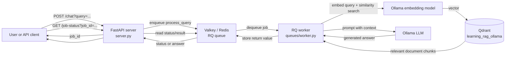
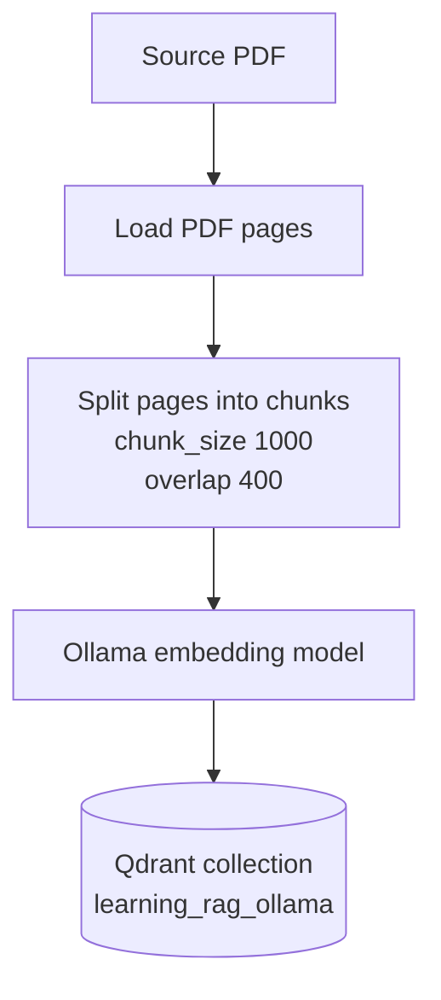
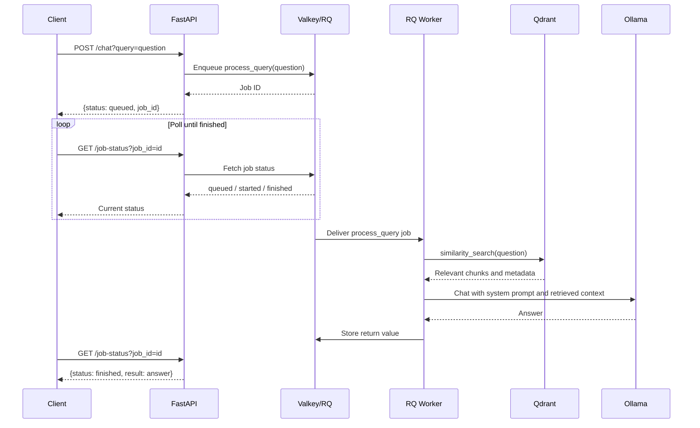
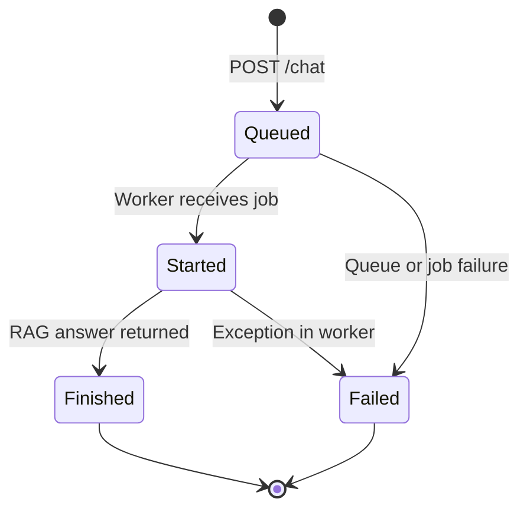

# Asynchronous RAG with RQ, Valkey, Qdrant, and Ollama

This example exposes a Retrieval-Augmented Generation (RAG) API whose expensive work runs in a background RQ worker. The API returns a job ID immediately, while the worker retrieves relevant document chunks from Qdrant and asks an Ollama-hosted LLM to generate an answer.

## What This Example Teaches

- How to place a blocking RAG workflow behind an HTTP API.
- How RQ uses Valkey/Redis as a job queue and job-status store.
- How semantic search retrieves context from an existing Qdrant collection.
- How retrieved context is passed to an Ollama chat model.
- How a client submits a job and polls until the answer is ready.

## Architecture



### Responsibilities

| Component | Responsibility |
| --- | --- |
| `server.py` | Defines the FastAPI health, submit, and status endpoints. |
| `client/rq_client.py` | Creates the RQ queue and connects it to Valkey on `localhost:6379`. |
| `queues/worker.py` | Connects to Ollama and Qdrant, retrieves context, and generates the answer. |
| `../../docker-compose.yml` | Starts the shared Ollama, Qdrant, and Valkey services. |
| `main.py` | Starts the FastAPI application with Uvicorn on port `8000`. |
| Qdrant | Stores embedded document chunks and their metadata. |
| Ollama | Provides both the embedding model and the chat-generation model. |

## RAG Pipeline

There are two related pipelines: an offline indexing pipeline and the online question-answering pipeline.

### 1. Offline indexing pipeline

The index must exist before the worker can answer questions. The neighboring `06_rag/index.py` example creates the collection used here.



The indexed records retain page metadata such as `page_label` and `source`. The worker uses this metadata to cite the page and source in the prompt sent to the LLM.

### 2. Online asynchronous question pipeline



### Worker-level RAG steps

1. `process_query(query)` receives the user question.
2. `QdrantVectorStore` embeds the question with `OLLAMA_EMBEDDING_MODEL`.
3. Qdrant performs similarity search in `learning_rag_ollama`.
4. The returned chunks are joined into a context string with page and source metadata.
5. A system prompt instructs the LLM to answer only from the retrieved context.
6. Ollama generates the answer using `OLLAMA_LLM_MODEL`.
7. The answer is returned from the job and stored by RQ.

## Request State Machine



The current status endpoint returns the RQ status for unfinished jobs. For a finished job it returns the generated answer. Failed jobs should be inspected through RQ/worker logs because this example does not yet expose the exception through the API.

## Prerequisites

- Python 3.12 or newer.
- Dependencies installed from the repository root.
- Docker Desktop or another Docker runtime.
- Ollama running and reachable at the configured base URL.
- The configured embedding and LLM models pulled into Ollama.
- A Qdrant instance running at `http://localhost:6333`.
- The Qdrant collection `learning_rag_ollama` already populated with document chunks.

> The shared Compose file at the repository root starts Valkey, Qdrant, and Ollama together.

## Configuration

Create a `.env` file in the repository root or in the process working directory:

```env
OLLAMA_BASE_URL=http://localhost:11434/
OLLAMA_EMBEDDING_MODEL=qwen3-embedding:0.6b
OLLAMA_LLM_MODEL=<your-ollama-chat-model>
```

The variable names are read by `queues/worker.py`. The embedding model must be compatible with the embeddings used when `learning_rag_ollama` was indexed.

## Run the System

Run the infrastructure command from the repository root, then run the Python processes from this directory.

### 1. Start Valkey

```powershell
cd ../..
docker compose up -d ollama qdrant valkey
cd Generative_AI/07_rag_queue
```

### 2. Start Qdrant

Qdrant is started by the root Compose file. Run the indexing example from `Generative_AI/06_rag/` if the collection has not been created yet. Adjust the PDF path and embedding settings as needed.

### 3. Start an RQ worker

```powershell
rq worker
```

The worker listens to the default RQ queue, which is the queue created by `Queue(...)` in `client/rq_client.py`.

### 4. Start the API

```powershell
python main.py
```

The API is available at `http://localhost:8000`. FastAPI's interactive documentation is at `http://localhost:8000/docs`.

## API Usage

### Health check

```powershell
Invoke-RestMethod http://localhost:8000/
```

Expected response:

```json
{"status": "Server is UP and Running"}
```

### Submit a question

```powershell
$response = Invoke-RestMethod `
  -Method Post `
  -Uri "http://localhost:8000/chat?query=What%20is%20described%20in%20the%20book%3F"
$response
```

Response shape:

```json
{
  "status": "queued",
  "job_id": "<rq-job-id>"
}
```

### Check the result

```powershell
Invoke-RestMethod `
  "http://localhost:8000/job-status?job_id=$($response.job_id)"
```

While processing:

```json
{"status": "started"}
```

When complete:

```json
{
  "status": "finished",
  "result": "Answer generated from the retrieved context..."
}
```

A missing job ID produces HTTP `404`.

## Repository Flow at a Glance

```text
07_rag_queue/
├── main.py                 # Uvicorn entry point
├── server.py               # FastAPI routes
├── docker-compose.yml      # Valkey service
├── client/
│   └── rq_client.py        # RQ queue connection
└── queues/
    └── worker.py           # Retrieval + generation job
```

## Important Revision Notes

- This is asynchronous from the API client's perspective; the worker itself performs synchronous retrieval and generation.
- `localhost:6379` is hard-coded for the Valkey connection in `client/rq_client.py`.
- `http://localhost:6333/` and `learning_rag_ollama` are hard-coded in `queues/worker.py`.
- The worker performs a default similarity search and does not currently configure `k`, filters, reranking, or score thresholds.
- The API returns a job ID instead of holding the HTTP request open while Ollama responds.
- The answer is grounded by the prompt, but the application does not independently verify citations or prevent hallucinations beyond that instruction.
- Start the worker before submitting questions, otherwise jobs remain queued.
- The worker imports the vector store at startup, so Qdrant and the configured embedding model should be available before the worker starts.

## Troubleshooting Checklist

| Symptom | Likely cause | Check |
| --- | --- | --- |
| Jobs remain `queued` | No RQ worker is running or it cannot connect to Valkey | Run `rq worker` and check Valkey on port `6379`. |
| Worker cannot connect to Qdrant | Qdrant is stopped or using another URL | Check `http://localhost:6333` and the worker configuration. |
| Collection not found | Indexing has not been run or collection name differs | Confirm `learning_rag_ollama` exists in Qdrant. |
| Ollama connection error | Ollama is stopped or base URL is wrong | Check `OLLAMA_BASE_URL` and Ollama availability. |
| Poor or empty answers | Wrong embedding model or weak retrieval context | Use the same embedding model for indexing and querying; inspect retrieved chunks. |
| `404 Job not found` | Unknown, expired, or incorrect job ID | Use the exact ID returned by `POST /chat`. |

## Extension Ideas

- Add a dedicated `queue` name and configure it explicitly on both producer and worker.
- Add a `/job-status/{job_id}` route and a timeout or result expiration policy.
- Return structured citations containing page number, source, and similarity score.
- Add request validation and limits for query length.
- Add retries and failure responses for temporary Ollama, Qdrant, or Valkey outages.
- Add Qdrant and Ollama health checks to the API.
- Put Valkey, Qdrant, the API, and the worker into one Compose stack for reproducible startup.
