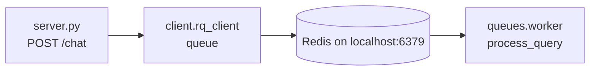

# RQ Client Package

This package owns the Redis/RQ queue connection used by the asynchronous RAG API in the parent `07_rag_queue` example.

## Architecture



## Components

| File | Responsibility |
| --- | --- |
| `rq_client.py` | Creates a module-level `Queue` using `Redis(host="localhost", port="6379")`. |
| `__init__.py` | Marks the directory as an importable Python package. |

## How It Works

1. `server.py` imports `queue` from `client.rq_client`.
2. The `/chat` endpoint enqueues `queues.worker.process_query` with the user query.
3. RQ stores the job in Redis at `localhost:6379`.
4. A separate RQ worker process pulls the job and runs the worker function.

## Configuration

The Redis host and port are hard-coded in `rq_client.py`:

```python
Redis(host="localhost", port="6379")
```

The parent example README documents how to start the queue service and worker.

## Revision Notes

- This module is deliberately small; it centralizes queue creation so the API can import one shared queue object.
- Redis must be running before requests can be enqueued.
- The code uses the default RQ queue name because no custom name is passed to `Queue()`.
- If Redis moves off localhost, this is the package that currently needs the connection change.