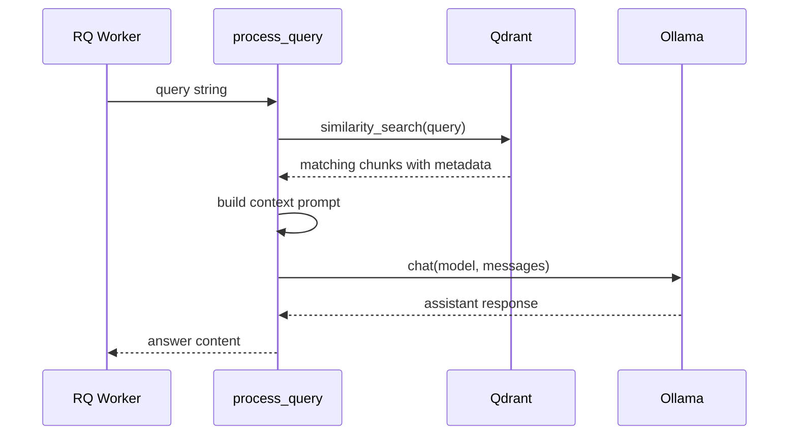

# RAG Queue Worker Package

This package contains the background job function for the asynchronous RAG example. The API enqueues work, and an RQ worker imports this package to run the retrieval and generation step outside the HTTP request cycle.

## Architecture

```mermaid
flowchart TD
    JOB[RQ job: process_query(query)] --> EMBED[OllamaEmbeddings]
    EMBED --> QDRANT[(Qdrant collection\nlearning_rag_ollama)]
    QDRANT --> CHUNKS[Similarity search results]
    CHUNKS --> PROMPT[System prompt with page content]
    PROMPT --> OLLAMA[Ollama chat model]
    OLLAMA --> RESULT[Returned answer]
```

## Components

| File | Responsibility |
| --- | --- |
| `worker.py` | Loads environment variables, connects to Qdrant, runs similarity search, calls Ollama chat, and returns the answer text. |
| `__init__.py` | Marks the directory as an importable Python package. |

## Runtime Flow



## Configuration

`worker.py` reads these values from the environment after `load_dotenv()`:

| Variable | Used for |
| --- | --- |
| `OLLAMA_EMBEDDING_MODEL` | Embedding model passed to `OllamaEmbeddings`. |
| `OLLAMA_BASE_URL` | Ollama embedding and chat host. |
| `OLLAMA_LLM_MODEL` | Chat model passed to `ollama.Client.chat`. |

The Qdrant URL and collection are hard-coded:

```python
url="http://localhost:6333/"
collection_name="learning_rag_ollama"
```

## Revision Notes

- The vector collection must already exist before the worker can answer questions.
- The prompt asks the model to answer only from retrieved PDF context and include page guidance.
- `process_query` prints both the search query and model answer, so worker logs are useful during revision.
- The function expects search results to include `page_label` and `source` metadata.