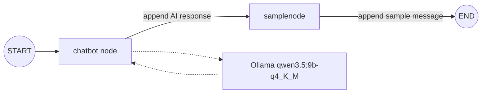
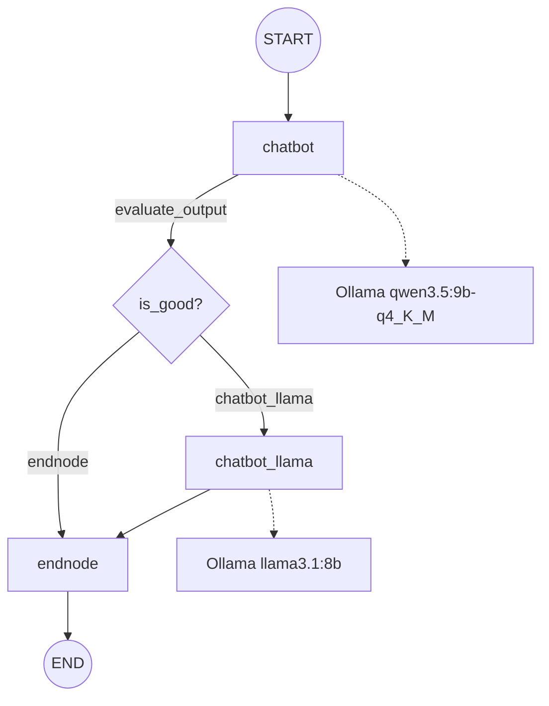

# Agentic Workflow with LangGraph

This folder demonstrates how to build small stateful workflows with LangGraph and locally hosted Ollama chat models. The examples progress from a fixed linear graph to a graph with a conditional evaluation step.

## Concepts Demonstrated

- Defining graph state with `TypedDict`.
- Passing state between LangGraph nodes.
- Accumulating chat messages with LangChain's `add_messages` reducer.
- Calling an Ollama model from a graph node.
- Connecting nodes with start and end edges.
- Adding a conditional edge for evaluation and fallback behavior.

## Architecture

The two scripts are independent examples.

### `chat.py`: linear message workflow



The graph state contains a `message` list. The `add_messages` reducer preserves the existing conversation and appends new human, AI, and node-generated messages.

### `chat_2.py`: evaluated model workflow



The intended design is to generate an answer with `qwen3.5:9b-q4_K_M`, evaluate it, and use `llama3.1:8b` when the answer is not good enough. In the current source, the evaluator always returns `endnode`, so the fallback node is not reached.

## Runtime Flow

### `chat.py`

1. `State` is initialized with the user message `Hi, my name in Astra.`.
2. The `chatbot` node sends the message history to the LangChain chat model.
3. The model response is appended to `message`.
4. `samplenode` prints the current state and appends `This is a sample node`.
5. The final state is printed after the graph reaches `END`.

### `chat_2.py`

1. The graph starts with `user_query: What is 2+2?`.
2. `chatbot` sends the query to the Ollama client using `qwen3.5:9b-q4_K_M`.
3. The response content is stored in `llm_output`.
4. `evalauate_output` selects the next node.
5. Because the current condition is `if True`, `endnode` runs immediately.
6. The final state is printed.

## Components

| File | Responsibility |
| --- | --- |
| `chat.py` | Fixed three-step graph using LangChain's `init_chat_model` and the Ollama provider. |
| `chat_2.py` | Conditional graph using the Ollama Python client and two configured model names. |
| `State` in `chat.py` | Stores an accumulated list of chat messages. |
| `State` in `chat_2.py` | Stores the user query, generated output, and evaluation flag. |
| Ollama | Runs the local chat models used by both examples. |

## Prerequisites

- Python 3.12 or newer.
- Project dependencies installed from the repository root.
- Ollama installed and running locally.
- The models referenced by the scripts are available in Ollama:
  - `qwen3.5:9b-q4_K_M`
  - `llama3.1:8b` for the fallback path in `chat_2.py`

The scripts use the Ollama client defaults. No environment variables are read by either file, so the Ollama service must be reachable at its default local configuration unless the client is configured externally.

## Run

From the repository root:

```powershell
uv sync
python Generative_AI/08_agentic_workflow/chat.py
python Generative_AI/08_agentic_workflow/chat_2.py
```

Or, after activating the repository virtual environment:

```powershell
.venv\Scripts\Activate.ps1
python Generative_AI/08_agentic_workflow/chat.py
python Generative_AI/08_agentic_workflow/chat_2.py
```

The scripts print node state and the final graph state to the terminal. Model-generated text can vary between runs.

## Revision Notes

- `chat.py` uses `init_chat_model(..., model_provider="ollama")`, while `chat_2.py` uses `ollama.Client()` directly.
- `chat.py` uses the `message` key, not the more common `messages` key. The graph reducer is attached to that exact key.
- `chat_2.py` declares `llm_output` and `is_good`, but the evaluator does not currently set or inspect `is_good`.
- The function name `evalauate_output` is misspelled in the source and in the graph registration. Renaming it would require updating both references.
- The `chatbot_llama` fallback assigns `response.output_text`; the Ollama Python client's chat response normally exposes generated text through `response.message.content`. The fallback is currently unreachable, but this should be corrected before enabling that branch.
- `chat_2.py` imports `init_chat_model` and `Optional` is used only for type annotations; the LangChain model import is not used in that script.

## Possible Improvements

- Replace the hard-coded `if True` with a real evaluation of `state["llm_output"]` and set `is_good` explicitly.
- Correct the fallback response field before routing requests to `chatbot_llama`.
- Add a retry or maximum-attempt counter so a failed evaluation cannot loop indefinitely.
- Move model names and the Ollama host into configuration.
- Add tests that invoke the graph with a mocked Ollama client and assert both conditional branches.
