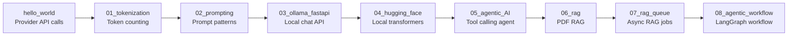
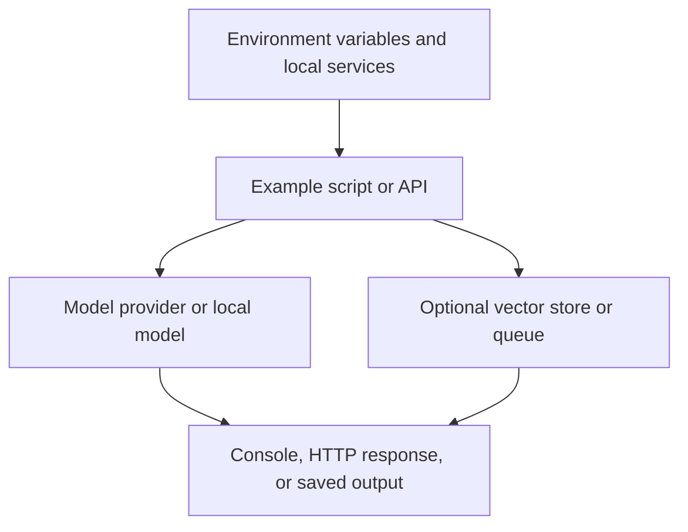

# Generative AI Revision Guide

This folder collects small Generative AI examples that move from provider API basics to local inference, retrieval augmented generation, queues, and agent-style workflows.

## Learning Map

## Folders

| Folder | Revision purpose |
| --- | --- |
| `hello_world/` | Compare basic OpenAI, Gemini, and response-format examples. |
| `01_tokenization/` | Count and inspect tokens with `tiktoken`. |
| `02_prompting/` | Practice zero-shot, few-shot, chain-of-thought style, and persona prompts. |
| `03_ollama_fastapi/` | Expose a local Ollama chat call through FastAPI. |
| `04_hugging_face/` | Run a local Hugging Face Transformers text-generation pipeline. |
| `05_agentic_AI/` | Study an agent folder and the nested weather-agent implementation. |
| `06_rag/` | Index a PDF into Qdrant and query it with Ollama. |
| `07_rag_queue/` | Add FastAPI, Redis/RQ, and worker execution around the RAG query path. |
| `08_agentic_workflow/` | Build simple LangGraph workflows around chat model calls. |

## Shared Dependencies

The repository dependency list in `pyproject.toml` includes the packages used across these examples, including `openai`, `google-genai`, `ollama`, `langchain`, `langchain-ollama`, `langchain-qdrant`, `langgraph`, `transformers`, `torch`, `fastapi`, `rq`, `pypdf`, and `tiktoken`.

## Common Runtime Shape

## How to Revise

1. Start with `hello_world/`, `01_tokenization/`, and `02_prompting/` to refresh core API, token, and prompt concepts.
2. Move to `03_ollama_fastapi/` and `04_hugging_face/` for local model serving and inference.
3. Use `06_rag/` before `07_rag_queue/` because the queued version assumes the same retrieval and generation ideas.
4. Review `05_agentic_AI/` and `08_agentic_workflow/` when focusing on tool calling, state, and graph-based orchestration.

## Revision Notes

- Some examples require environment variables from `.env`; check the folder README and source before running.
- RAG examples expect local services such as Qdrant, and the queued RAG example also expects Redis-compatible queue infrastructure.
- Existing folder READMEs contain the detailed run commands and known issues for each lesson.
- Generated files such as model outputs and indexed data should be treated as learning artifacts, not source-of-truth documentation.