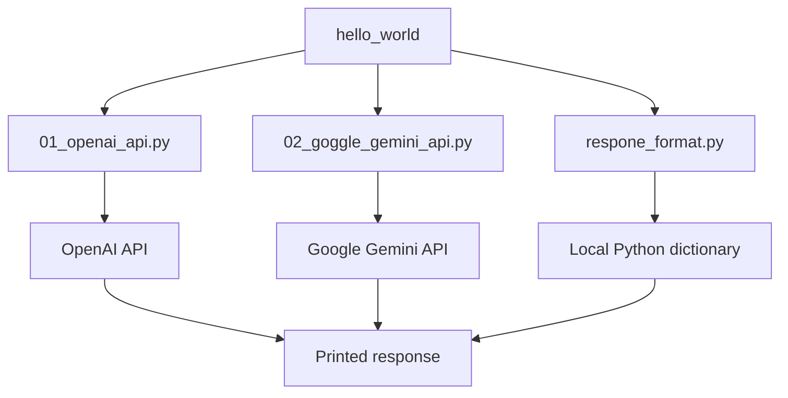
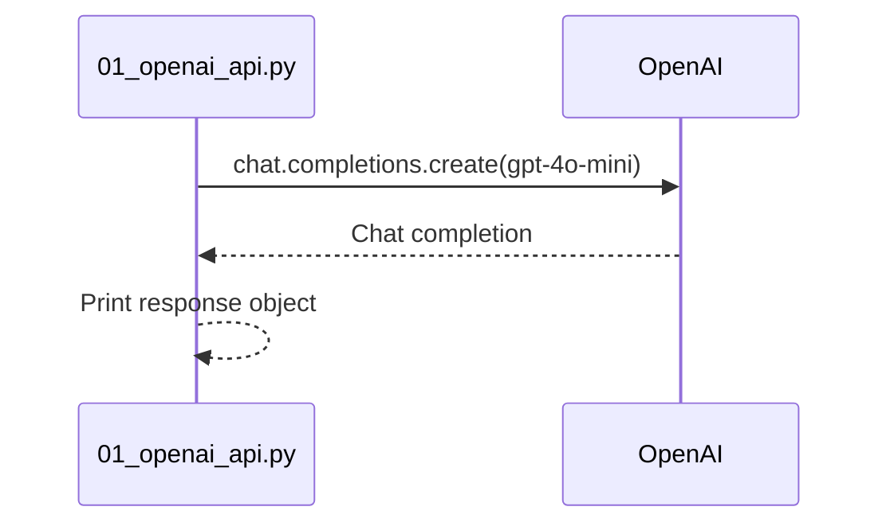
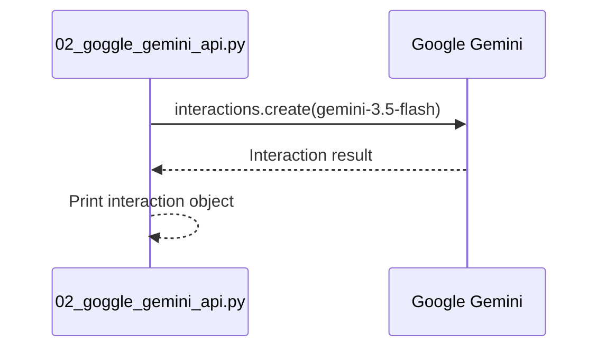

# Generative AI API Hello World

This folder contains minimal examples for calling OpenAI and Gemini, plus a local example that formats an API response as readable JSON. These scripts are the smallest entry point in the repository for understanding provider SDK calls.

## Architecture



## Files and Flows

| File | Flow | Output |
| --- | --- | --- |
| `01_openai_api.py` | Create OpenAI client -> Chat Completions request -> print response object | OpenAI response object |
| `02_goggle_gemini_api.py` | Create Gemini client -> interaction request -> print interaction | Gemini interaction object |
| `respone_format.py` | Build representative response dictionary -> serialize with `json.dumps` | Indented JSON |

The filenames are retained from the project, including the existing `goggle` and `respone` spellings.

### OpenAI flow



### Gemini flow



### Local response formatting flow

```mermaid
flowchart LR
    A[Representative response dict] --> B[json.dumps(indent=2)] --> C[Readable JSON]
```

## Configuration

The OpenAI and Gemini scripts use `python-dotenv` and expect credentials to be available through the SDK-supported environment variables in a `.env` file or the shell environment. Do not commit API keys.

## Run

From this directory:

```powershell
python 01_openai_api.py
python 02_goggle_gemini_api.py
python respone_format.py
```

The first two commands require network access and valid provider credentials. The response-format example is local-only and does not require an API key.

## Core Concepts

- SDK clients wrap authentication, request construction, and response parsing.
- A model request normally contains a model identifier and user input or messages.
- Provider response objects contain both generated content and metadata such as usage and finish status.
- JSON serialization makes nested response data easier to inspect and store.

## Revision Checklist

```text
[ ] Provider credentials are configured outside source control
[ ] The model name is available to the account or SDK version
[ ] The response object is inspected before extracting content
[ ] Network and API errors are handled in a real application
[ ] Sensitive request or response data is not logged
```

## Possible Extensions

- Print only the generated text instead of the full SDK response.
- Add exception handling for authentication, rate limits, and network errors.
- Compare equivalent prompts across OpenAI and Gemini.
- Save normalized provider responses to a common JSON schema.
- Add command-line arguments for model and prompt selection.
