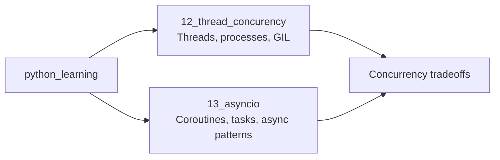

# Python Learning Revision Guide

This folder contains focused Python practice examples for concurrency, multiprocessing, and asynchronous programming.

## Folder Map



## Folders

| Folder | Revision purpose |
| --- | --- |
| `12_thread_concurency/` | Practice `threading`, `multiprocessing`, queues, shared values, locks, GIL behavior, and process startup rules. |
| `13_asyncio/` | Practice `asyncio.run`, `gather`, async HTTP calls, executor bridges, background workers, daemon threads, race conditions, and deadlocks. |

## Study Order

1. Review `12_thread_concurency/` first to understand when threads and processes are useful.
2. Review the GIL examples before comparing CPU-bound threading with multiprocessing.
3. Move to `13_asyncio/` to separate cooperative concurrency from OS threads and processes.
4. Finish with the race-condition and deadlock examples to revise synchronization failure modes.

## Run Examples

Run examples from the repository root so imports and paths are predictable:

```powershell
uv sync
uv run python_learning/12_thread_concurency/01_threading.py
uv run python_learning/13_asyncio/01_asyncio_one.py
```

Or with an active virtual environment:

```powershell
python python_learning/12_thread_concurency/01_threading.py
python python_learning/13_asyncio/01_asyncio_one.py
```

## Revision Notes

- The folder name `12_thread_concurency` is misspelled in the repository path; keep the existing path when running commands.
- Several examples intentionally demonstrate problematic behavior such as race conditions and deadlocks.
- The `13_asyncio/03_async_three.py` example depends on `aiohttp` for concurrent HTTP requests.
- Use the detailed README in each numbered folder for deeper explanations and comparison tables.